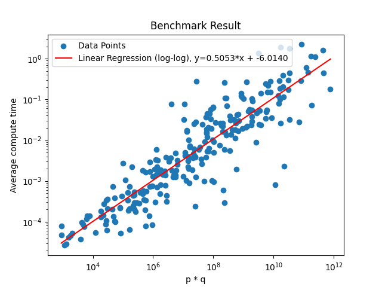

# PrimeFactorizer

## Concept

Given a number n, this script decomposes n into p * q, where p and q are prime numbers.

## Notes
- This script assumes n can be represented as a product of exactly two prime numbers.
- The script does not work with prime numbers less than 10.

## Performance and Results

As expected, this handmade algorithm is not highly efficient. While it does successfully find the correct result for many values, it takes a significant amount of time, especially for large numbers.

### Benchmark Results
Here’s a log-log plot showing the relationship between the product p * q and the average compute time for the factorization.

### Predicted Time for Solving ( n ≈ 10^308 ) (RSA 1024)

Based on the linear regression, we can estimate the time it would take to solve a number of approximately `n ≈ 10^308` (typical of RSA 1024-bit keys).

1. Calculate the log of the expected time:
   `log_time = 308 * 0.5053 - 6.014 = 149.6184`

2. Convert this to seconds:
   `time = 10^149.6184 seconds`

3. To express this in years:
   `time_years = 10^149.6184 / (60 * 60 * 24 * 365.25) ≈ 1.31614976 * 10^142 years`

This result indicates that solving an RSA 1024-bit problem with this algorithm would take an unfeasibly long time, about `1.31614976 * 10^142` years, which is ... really long ??

### Note!
These results were achieved using Python on a **not so good computer**. If implemented in C++ and run on a high-performance, "monster" computing setup, the performance would likely improve significantly.

However, it’s important to remember that this is a handmade algorithm with no intention to compete with the best-in-class factoring algorithms. It was just fun coding it
